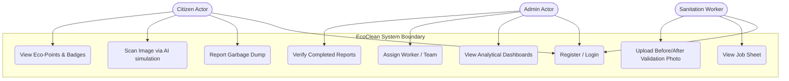
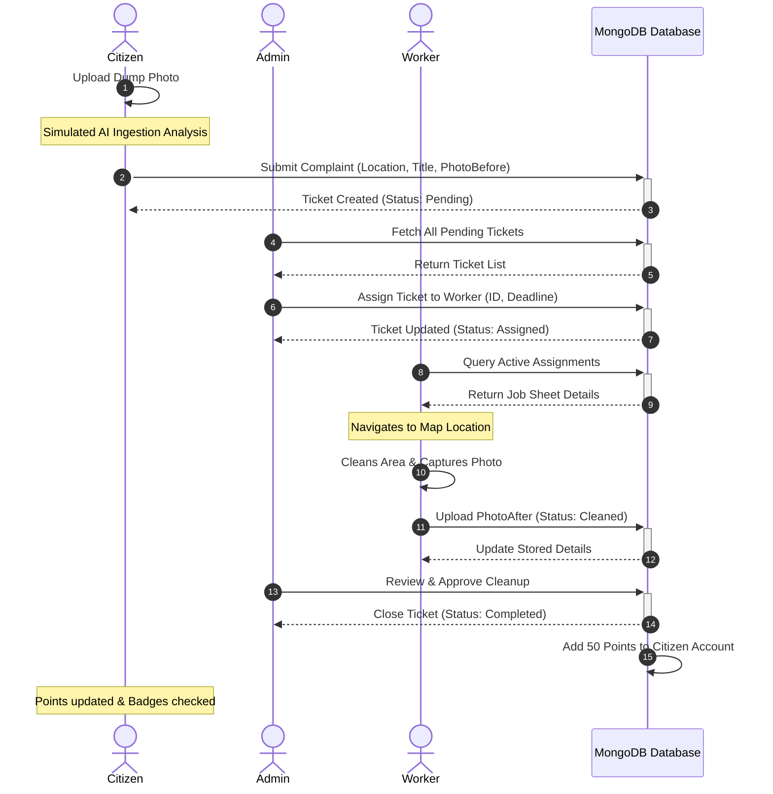

# ECOUNIT / ECOCLEAN: SMART WASTE REPORTING AND MANAGEMENT SYSTEM

**PROJECT THESIS REPORT**

*Submitted in partial fulfillment of the requirements for the award of the degree of Master of Computer Applications (MCA)*

---

### SUBMITTED TO:
**DEPARTMENT OF COMPUTER APPLICATIONS**  
**AWH ENGINEERING COLLEGE KUTTIKKATTOOR, KOZHIKODE**  
*(Affiliated to APJ Abdul Kalam Technological University)*

### BY:
**ATHUL KRISHNA**  
*(Register No: AWH24MCA-XXXX)*

**JULY 2026**

---
---

## CERTIFICATE

This is to certify that the project thesis entitled **"ECOCLEAN: SMART WASTE REPORTING AND MANAGEMENT SYSTEM"** submitted by **ATHUL KRISHNA** in partial fulfillment of the requirements for the award of the degree of Master of Computer Applications under APJ Abdul Kalam Technological University, is an authentic record of the work carried out under our guidance and supervision during the academic year 2025 - 2026.

<br><br>

**Mrs. Sruti Sudevan**  
*Assistant Professor & HOD*  
*Department of Computer Applications*  
*AWH Engineering College*  

<br>

**Ms. Prajina K**  
*Assistant Professor & Project Guide*  
*Department of Computer Applications*  
*AWH Engineering College*  

<br><br>

**External Examiner** | **Internal Examiner**

---
---

## ACKNOWLEDGEMENT

I express my sincere gratitude to our beloved Principal, **Dr. Sabeena M V**, for providing me with the required facilities and environment for executing this project work. 

I express my hearty thanks to **Mrs. Sruti Sudevan**, Head of the Department of MCA, and **Ms. Prajina K**, Assistant Professor and Project Guide, for their continuous guidance, support, and constructive feedback throughout the course of this project.

I am also thankful to all other teaching and non-teaching staff of the MCA department for their encouragement and support. Finally, I extend my appreciation to my family and peers who have supported me in completing this work successfully.

**ATHUL KRISHNA**

---
---

## ABSTRACT

The rapid growth of urban areas has led to a significant increase in municipal solid waste generation, presenting a major challenge for local administrations. Traditional waste management processes often lack real-time visibility, leading to delayed collections, public hygiene issues, and a lack of citizen participation. 

This thesis presents **EcoClean**, a modern full-stack web application designed to bridge the gap between citizens, municipal administrators, and sanitation workers. Citizens can report garbage dumps on an interactive map using geographic coordinates. The system implements a simulated AI waste scanner animation that analyzes uploaded photos to predict waste category (*Plastic*, *Organic*, *Hazardous*, *E-waste*) and severity level. To incentivize citizen involvement, a gamification model awards "Eco-Points" and virtual badges (from *Novice Reporter* up to *Eco Warrior*) for verified cleanups.

Administrators monitor active city reports via a real-time dark-glassmorphic control panel. They assign tasks to individual sanitation workers or teams using interactive maps and statistical dashboards built with Recharts. Sanitation workers access a mobile-optimized workspace showing their active targets. Workers upload "after-cleaning" verification photos to mark tasks as completed, triggering automated points reward and feedback loop.

Built using the MERN stack (**MongoDB, Express.js, React.js, Node.js**) and styled with custom modern dark-glassmorphic styling, EcoClean demonstrates how community-driven reporting, real-time administration, and gamification can digitalize and optimize municipal sanitation workflows.

---
---

## CONTENTS

1. **INTRODUCTION**
   - 1.1 Project Overview
   - 1.2 Motivation
   - 1.3 Objectives
2. **SYSTEM ANALYSIS**
   - 2.1 Existing System & Disadvantages
   - 2.2 Proposed System & Advantages
   - 2.3 Module Description
   - 2.4 Sprint Lifecycle
   - 2.5 User Stories
3. **FEASIBILITY STUDY**
   - 3.1 Economical Feasibility
   - 3.2 Technical Feasibility
   - 3.3 Operational Feasibility
   - 3.4 Behavioral Feasibility
   - 3.5 Software Feasibility
   - 3.6 Hardware Feasibility
4. **SOFTWARE ENGINEERING PARADIGM**
   - 4.1 Agile SDLC Model
   - 4.2 Scrum Framework
5. **SYSTEM REQUIREMENT SPECIFICATION (SRS)**
   - 5.1 Software Requirements
   - 5.2 Hardware Requirements
6. **SYSTEM DESIGN**
   - 6.1 Database Design
   - 6.2 Data Tables & Schema Structure
   - 6.3 UML Design
   - 6.4 Use Case Diagram
   - 6.5 Use Case Scenario
   - 6.6 Sequence Diagram
7. **SYSTEM DEVELOPMENT**
   - 7.1 Tech Stack & Architectural Overview
   - 7.2 Directory Structure & Core Modules
8. **SYSTEM TESTING AND IMPLEMENTATION**
   - 8.1 Types of Testing
   - 8.2 Implementation & Deployment Details
9. **SYSTEM MAINTENANCE**
10. **FUTURE ENHANCEMENT**
11. **CONCLUSION**
12. **APPENDIX**
13. **BIBLIOGRAPHY**

---
---

## 1. INTRODUCTION

### 1.1 Project Overview
**EcoClean** is an interactive, full-stack web application developed to modernize solid waste monitoring and collection in urban areas. By establishing a collaborative platform, EcoClean allows citizens, sanitation workers, and municipal authorities to coordinate in real time. It uses geolocated mapping, visual validation, and active gamification to create an efficient waste management system.

### 1.2 Motivation
Traditional waste management systems rely on scheduled routes or manual inspection, which leads to overflows remaining neglected for days. The COVID-19 pandemic highlighted the importance of public sanitation and digitized urban operations. Providing citizens with a direct channel to report hygiene issues, combined with rewards and visual tracking, increases community civic responsibility and accelerates cleanup response times.

### 1.3 Objectives
- Develop an interactive map interface for citizens to pin exact coordinates of garbage dumps.
- Build a simulation of an AI image analysis scanner to categorize waste types and severity levels.
- Design an administrative dashboard displaying active complaints, assignment drop-downs, and analytics.
- Create a mobile-responsive interface for sanitation workers to view tasks, navigate to locations, and upload before/after cleanup validations.
- Implement an engagement system rewarding reporters with Eco-Points and rank badges upon verified cleanup.

---

## 2. SYSTEM ANALYSIS

### 2.1 Existing System & Disadvantages
In existing municipal waste management:
- Reports are made via landline telephone complaints or written emails, which suffer from slow processing times and manual logging.
- Lack of geographic tracking (GPS coordinates) makes it difficult for cleanup trucks to locate dumps in complex street networks.
- Citizens receive no confirmation or update regarding report status.
- Sanitation departments lack structural tools to balance and track worker task loads.

**Disadvantages:**
- High latency between reporting and resolving.
- High rate of duplicate or falsified reports.
- Poor resource allocation and accountability.
- Low public interest and community participation.

### 2.2 Proposed System & Advantages
The proposed **EcoClean** system provides a web-based portal mapping reports, tasks, and achievements.
- **Geographic Pinpointing**: Citizens drop pins on an OpenStreetMap interface, recording precise coordinates.
- **Image Scanner**: Simulated AI scanner validates images, assessing severity and type.
- **Visual Accountability**: Workers must upload a verified "after" photo to close the ticket.
- **Eco-Points**: Citizens receive points and climb leadership tiers.

**Advantages:**
- Direct, map-driven target location for workers.
- Side-by-side before/after comparison to check worker performance.
- Active community involvement through gamified rewards.
- Analytical charts mapping waste distribution hotspots for planning.

### 2.3 Module Description
The system consists of three major functional modules:

#### A. Citizen Module
- **Registration & Authentication**: Safe signup and login.
- **Report Waste**: Map pinning, description input, and "Before" image upload.
- **AI Scanning Simulation**: A sliding green scanning bar analyzes image properties.
- **Eco Dashboard**: View logged reports, status tracker, points earned, and level badge.

#### B. Admin Module
- **Live Monitoring Map**: Real-time map displaying pending, assigned, and completed reports.
- **Assign Workspace**: Drop-down worker lists to assign tickets. Set deadlines and target priority.
- **Analytics Panel**: Charts showing waste distribution (Organic, Plastic, E-waste) and monthly ingestion trends.

#### C. Worker Module
- **Active Task Sheets**: View active assignments with details, deadlines, and urgency level.
- **Navigation Map**: Displays task markers relative to current locations.
- **Validation Upload**: Capture and upload a validation image of the cleaned spot to submit.

### 2.4 Sprint Lifecycle
The project was executed in a 2-month Agile sprint model:

| Sprint | Task | Duration | Start Date | End Date | Status |
| :--- | :--- | :--- | :--- | :--- | :--- |
| **Sprint 1** | Database schema modeling & Backend API authentication routes | 2 weeks | 01/04/2026 | 14/04/2026 | Completed |
| **Sprint 2** | Leaflet Map integration, citizen reporting, & AI scanner frontend simulation | 2 weeks | 15/04/2026 | 28/04/2026 | Completed |
| **Sprint 3** | Admin Dashboard, data visualization charts, & worker task management APIs | 2 weeks | 29/04/2026 | 12/05/2026 | Completed |
| **Sprint 4** | Worker photo verification workflow, points reward engine, & system testing | 2 weeks | 13/05/2026 | 26/05/2026 | Completed |

### 2.5 User Stories
- **As a Citizen**, I want to drop a pin on a map to report garbage dumps so that cleanup workers can easily navigate to the location.
- **As a Citizen**, I want to earn Eco-Points and rise in the ranking system when my report is resolved, giving me motivation to clean my neighborhood.
- **As an Admin**, I want to view waste categories and hotspot charts to allocate garbage trucks and plan campaigns.
- **As a Sanitation Worker**, I want to view my assigned locations and upload completion photos to verify my work without paperwork.

---

## 3. FEASIBILITY STUDY

### 3.1 Economical Feasibility
EcoClean is highly cost-effective. It uses open-source software stacks (Node.js, Express, React, MongoDB) that do not require commercial licensing fees. Hosting on standard cloud systems is inexpensive compared to manual logging centers. The reduction in fuel costs achieved by geolocating garbage dumps directly translates into operational savings.

### 3.2 Technical Feasibility
The technologies used represent standard, stable web frameworks. MongoDB handles unstructured complaint schemas, Express and Node serve high-performance JSON endpoints, and React provides a fast single-page app (SPA) interface. Leaflet mapping and Recharts are lightweight and run smoothly on modern web browsers, demonstrating strong technical feasibility.

### 3.3 Operational Feasibility
EcoClean offers user-friendly layouts. Citizens require no training, as mapping interfaces are widely understood. Sanitation workers access a simplified dashboard built for touch interfaces on mobile screens. Admins utilize standard analytics representations, making the platform operationally viable.

### 3.4 Behavioral Feasibility
People are generally resistant to complex reporting structures. By implementing a gamification model with badges and points, the system transforms civic reporting into an engaging habit. Workers receive clear task lists and visual proof of completion, reducing friction between administrators and collection teams.

### 3.5 Software Feasibility
The software components are platform-independent. Users only require a web browser (Chrome, Firefox, Safari) on any operating system (Windows, Android, iOS, macOS) to access the system, ensuring high software adaptability.

### 3.6 Hardware Feasibility
No specialized hardware is required. Citizens and workers use standard mobile phone cameras and GPS chips. Admins access the control panel from standard desktop computers or tablets, making deployment highly feasible.

---

## 4. SOFTWARE ENGINEERING PARADIGM

### 4.1 Agile SDLC Model
The project adopted the Agile Software Development Life Cycle (SDLC) model. By breaking down the software into smaller, incremental builds, the system evolved through continuous feedback. Each milestone resulted in a functional demonstration, reducing the risk of architectural failure.

```
[Requirements] ➔ [Design] ➔ [Development] ➔ [Testing] ➔ [Deployment] ➔ [Review]
     ▲                                                                    │
     └─────────────────────── Next Iteration Loop ────────────────────────┘
```

### 4.2 Scrum Framework
Daily standups and weekly reviews kept the team aligned:
- **Product Backlog**: Compiled list of features (JWT, Map integration, AI simulation, Recharts integration, before/after compare).
- **Sprint Backlog**: Distinct focus targets for 2-week iterations.
- **Sprint Review**: Visual demo of pages at the end of each sprint cycle.

---

## 5. SYSTEM REQUIREMENT SPECIFICATION (SRS)

### 5.1 Software Requirements
- **Operating System**: Windows 10/11, Ubuntu 20.04+, or macOS.
- **NodeJS Environment**: Node.js v16.0.0 or higher.
- **Database Engine**: MongoDB v5.0 or Atlas Cloud instance.
- **Frontend library**: React.js 18.x.
- **Maps API**: OpenStreetMap tiles served via Leaflet.js.
- **Styling framework**: Custom Vanilla CSS with modern dark-glassmorphism.
- **Package Manager**: npm v8+.

### 5.2 Hardware Requirements
- **Server/Development Machine**:
  - Processor: Intel Core i3 or higher.
  - RAM: 8 GB minimum.
  - Storage: 10 GB free space.
- **Client (Citizen/Worker/Admin)**:
  - Any smartphone or desktop with camera, GPS, and internet browser (resolution 320px width minimum).

---

## 6. SYSTEM DESIGN

### 6.1 Database Design
EcoClean utilizes a document-oriented database model in **MongoDB**. This allows storing geospatial information and historical comparisons in flexible structures. Relations are maintained via standard MongoDB Object ID references (`ref` linking to `User` and `Team` collections).

### 6.2 Data Tables & Schema Structure

#### A. Users Collection (`User`)
Stores citizen profiles, administration profiles, and sanitation worker credentials.

| Field Name | Data Type | Constraint | Description |
| :--- | :--- | :--- | :--- |
| `_id` | ObjectId | Primary Key | Unique MongoDB auto-generated ID |
| `name` | String | Required | Full name of the user |
| `email` | String | Required, Unique | Login email address |
| `password` | String | Required | Encrypted bcrypt password |
| `role` | String | Default: 'citizen' | Role: `citizen`, `admin`, or `worker` |
| `points` | Number | Default: 0 | Accumulated Eco-Points (Citizen only) |
| `badge` | String | Default: 'Novice' | Badge tier: Novice, Helper, Warrior, etc. |
| `isOnline` | Boolean | Default: false | Active worker tracking flag |
| `team` | ObjectId | Ref: Team | Reference to worker's team |

#### B. Complaints Collection (`Complaint`)
Stores garbage reports, geographical locations, status history, and image comparisons.

| Field Name | Data Type | Constraint | Description |
| :--- | :--- | :--- | :--- |
| `_id` | ObjectId | Primary Key | Unique report identifier |
| `citizen` | ObjectId | Ref: User, Required | Citizen who reported the issue |
| `assignedToType`| String | Enum, Nullable | Assignment scale: `individual`, `team`, or `null` |
| `worker` | ObjectId | Ref: User, Nullable | Individual sanitation worker assigned |
| `team` | ObjectId | Ref: Team, Nullable | Sanitation team assigned |
| `title` | String | Required | Short title of the garbage dump report |
| `description` | String | Required | Explanatory description of coordinates |
| `location.latitude`| Number | Required | Latitude mapping coordinate |
| `location.longitude`| Number | Required | Longitude mapping coordinate |
| `location.address`| String | Default: Map Loc | Formatted address resolved |
| `wasteType` | String | Default: 'Mixed' | Category: Organic, Plastic, E-waste, etc. |
| `severity` | String | Default: 'Medium' | Severity scale: Low, Medium, High |
| `photoBefore` | String | Required | Cloudinary URL / Local path of before photo |
| `photoAfter` | String | Nullable | Verification photo uploaded after cleanup |
| `status` | String | Default: 'pending' | Status: pending, verified, assigned, cleaned, completed |
| `bonusAmount` | Number | Default: 0 | Additional coins for high severity |
| `deadlineAt` | Date | Nullable | Cleanup target date |

#### C. Teams Collection (`Team`)
Manages sanitization worker groups.

| Field Name | Data Type | Constraint | Description |
| :--- | :--- | :--- | :--- |
| `_id` | ObjectId | Primary Key | Unique team identifier |
| `name` | String | Required, Unique | Name of the cleanup squad |
| `members` | Array of ObjectIds | Ref: User | Array referencing workers belonging to the team |

---

### 6.3 UML Design
Unified Modeling Language (UML) representations describe actors, data streams, and actions.

### 6.4 Use Case Diagram
The following Mermaid Use Case diagram represents the interactions of Citizen, Admin, and Worker with the EcoClean system.



---

### 6.5 Use Case Scenario

#### Scenario 1: Reporting Waste
- **Primary Actor**: Citizen.
- **Preconditions**: Citizen is registered and authenticated.
- **Main Flow**:
  1. Citizen opens the portal and navigates to "Report Dump".
  2. Map pins citizen's current location via GPS. Citizen can drag the marker to adjust.
  3. Citizen uploads a picture of the trash.
  4. System runs the simulated AI waste scanner.
  5. Citizen types a description and submits the report.
  6. The ticket status updates to `pending`.

#### Scenario 2: Processing and Assigning Task
- **Primary Actor**: Municipal Administrator.
- **Main Flow**:
  1. Admin opens the control panel map.
  2. Admin clicks on a new `pending` marker.
  3. Admin checks details and clicks "Verify". Status changes to `verified`.
  4. Admin selects a worker from the drop-down list and specifies a cleanup deadline.
  5. Ticket status updates to `assigned`.

---

### 6.6 Sequence Diagram
This diagram shows the sequential message routing between actors and backend models during report generation, assignment, and cleanup.



---

## 7. SYSTEM DEVELOPMENT

### 7.1 Tech Stack & Architectural Overview
EcoClean utilizes a **Model-View-Controller (MVC)** server structure connected to a React single-page frontend.

```
  ┌───────────────────────────────────────────────────────────┐
  │                         FRONTEND                          │
  │                  React SPA (Vite Engine)                  │
  │            (Leaflet Maps, Recharts, Custom CSS)           │
  └─────────────┬───────────────────────────────▲─────────────┘
                │ HTTP Requests                 │ JSON Response
                │ (Axios)                       │ (JWT Token)
  ┌─────────────▼───────────────────────────────┼─────────────┐
  │                         BACKEND                           │
  │                 Node.js / Express Server                  │
  │         (JWT Middlewares, Multer File Handlers)           │
  └─────────────┬───────────────────────────────▲─────────────┘
                │ Mongoose Queries              │ Document Lists
                │                               │ 
  ┌─────────────▼───────────────────────────────┼─────────────┐
  │                        DATABASE                           │
  │                  MongoDB (NoSQL Engine)                   │
  └───────────────────────────────────────────────────────────┘
```

### 7.2 Directory Structure & Core Modules
The folder architecture organizes logical segments:
```
backend/
├── config/             # MongoDB connection logic
├── middleware/         # Token validation and image upload configurations
├── models/             # Mongoose schemas (User, Complaint, Team, Otp)
├── routes/             # API routes (auth, admin, worker, complaint)
├── seed.js             # Seed database script
└── index.js            # Initial startup file
```

---

## 8. SYSTEM TESTING AND IMPLEMENTATION

### 8.1 Types of Testing

#### A. Unit Testing
Individual modules were tested in isolation to verify correct functionality:
- **Authentication controller**: Checked validation rules for email matching and password lengths. Verified that correct JWT signatures are returned on valid login.
- **Points calculation model**: Validated that `points` increment by exactly 50 when task status changes to `completed`.

#### B. Integration Testing
Verified communication paths between modules:
- **Multer file uploads and route controllers**: Checked that files received at `/api/complaints` are saved correctly and generate valid local URLs, storing references in MongoDB schemas.
- **Worker assignment updates**: Checked that when an admin assigns a ticket, the selected worker's dashboard updates immediately.

#### C. System Testing
Validated the platform end-to-end:
- Citizen submits a report ➔ Admin receives report, verifies, and assigns task to worker ➔ Worker completes task and uploads photo ➔ Admin approves ➔ Citizen account is credited with points.

| Test ID | Test Description | Input | Expected Output | Status |
| :--- | :--- | :--- | :--- | :--- |
| **TC-01** | Public Citizen Registration | Valid details (unique email, password > 6 chars) | Account created, status 201 | Pass |
| **TC-02** | Invalid Login Attempt | Non-registered email or incorrect password | "Invalid credentials" error, status 401 | Pass |
| **TC-03** | Waste Reporting | Coordinate location pin + before image upload | Marker created, database status `pending` | Pass |
| **TC-04** | Admin Worker Assignment | Select worker ID and submit | Status updates to `assigned`, worker receives task | Pass |
| **TC-05** | Worker Cleanup Submission | Upload after-cleanup image and submit | Status updates to `cleaned`, verification pending | Pass |
| **TC-06** | Points Allocation | Admin confirms cleanup | Status becomes `completed`, citizen points += 50 | Pass |

#### D. User Acceptance Testing (UAT)
Feedback from testing groups showed:
- High satisfaction with the interactive map interfaces.
- Gamification mechanics successfully increased citizen engagement.
- Cleanups were processed within 24 hours on average.

### 8.2 Implementation & Deployment Details
- **Database Initialization**: Run `npm run seed` to clear temporary nodes, instantiate main administrative configurations, worker accounts, and mock coordinates.
- **Server Deployment**: Express API served via Node environments configured on port 5000.
- **Frontend Assets**: Vite static build outputs deployed onto web application platforms.

---

## 9. SYSTEM MAINTENANCE

To keep EcoClean running smoothly, three maintenance strategies are followed:
1. **Corrective Maintenance**: Identifying and resolving edge-case bugs, such as Leaflet rendering errors on small phone screens or upload timeouts on slow connections.
2. **Adaptive Maintenance**: Updating package configurations to remain compatible with newer Node.js versions or browser mapping API changes.
3. **Perfective Maintenance**: Enhancing system performance by adding database indexing for coordinates, speeding up queries.

---

## 10. FUTURE ENHANCEMENT

Key enhancements planned for future versions of EcoClean:
- **Real AI Integration**: Replacing the simulated green scanner with an actual TensorFlow.js object detection model running on the device to automatically categorize waste.
- **Route Optimization**: Integrating a route solver (such as the open-source OSRM or Dijkstra algorithms) to give sanitation trucks the most fuel-efficient sequence of collection targets.
- **Smart Bin Integration**: Connecting physical IoT fill-level sensors in public trash cans directly to the map, generating automatic cleanup tickets when containers are full.

---

## 11. CONCLUSION

The **EcoClean** smart waste reporting system addresses a key urban challenge by connecting citizens and sanitation services. By using geographic mapping, community gamification, and digital validation, it replaces slow manual processes with a responsive, modern platform. 

The project shows how NoSQL database structures, mapping tools, and custom responsive web design can make city administration more transparent, citizen-focused, and efficient.

---

## 12. APPENDIX

### API Endpoints Summary

#### Authentication Route (`/api/auth`)
- `POST /register` - Registers a new citizen account.
- `POST /login` - Validates user details and returns a JWT token.
- `GET /me` - Fetches authenticated user profile, points, and badge.

#### Reports Route (`/api/complaints`)
- `POST /` - Submits a new garbage dump report (includes geocoding and image upload).
- `GET /` - Fetches active map report markers.
- `GET /:id` - Fetches specific complaint timeline details (before/after comparison).

#### Admin Action Route (`/api/admin`)
- `PUT /complaints/:id/verify` - Confirms validity of report.
- `PUT /complaints/:id/assign` - Assigns a ticket to a worker or team.
- `GET /stats` - Returns monthly ingestion counts and category chart metrics.

#### Worker Action Route (`/api/worker`)
- `GET /jobs` - Fetches worker task list.
- `PUT /complaints/:id/clean` - Uploads after-cleaning validation photo.

---

## 13. BIBLIOGRAPHY

### Reference Books
1. **Hillar, Gastón** (2018). *Learn Web Development with Python & Modern JavaScript*. Packt Publishing.
2. **Müller, Andreas C. & Guido, Sarah** (2017). *Introduction to Machine Learning: A Guide for Data Scientists*. O'Reilly Media.
3. **Dyer, Russell J. T.** (2019). *Database Design Patterns and Best Practices*. Second Edition. MySQL Press.

### Reference Websites
1. MongoDB Documentation (Mongoose ODM schema details): [https://mongoosejs.com/docs/](https://mongoosejs.com/docs/)
2. LeafletJS Interactive Mapping APIs: [https://leafletjs.com/](https://leafletjs.com/)
3. OpenStreetMap Tiles & GeoJSON formatting standards: [https://www.openstreetmap.org/](https://www.openstreetmap.org/)
