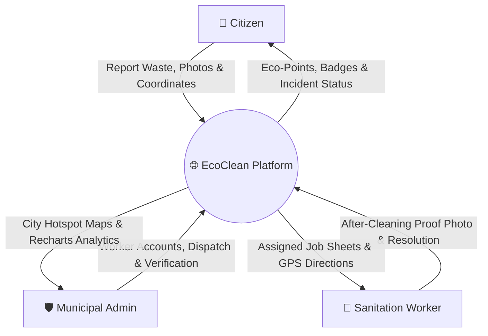
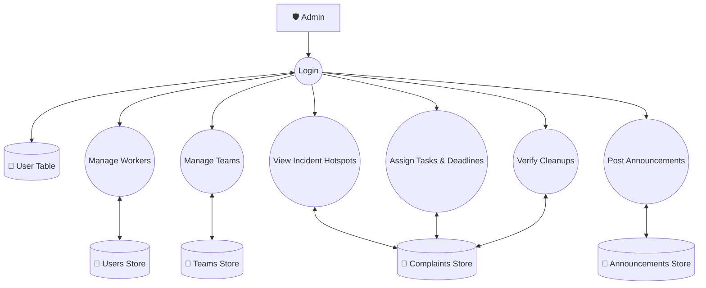
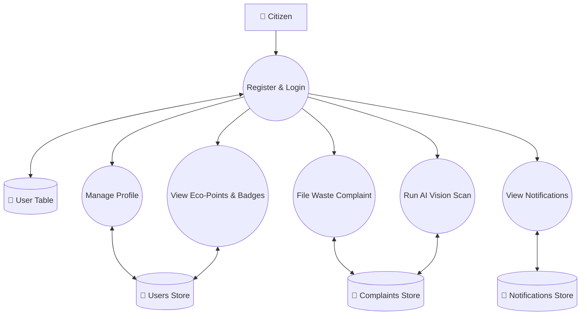
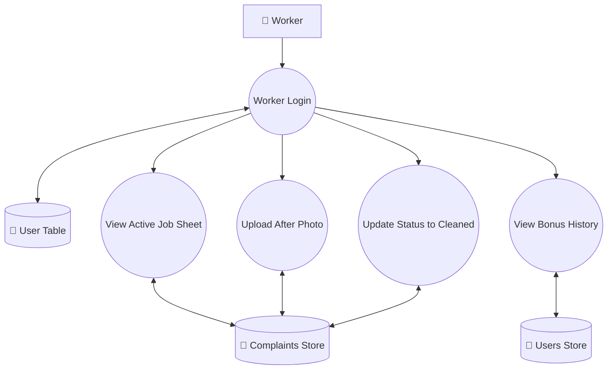
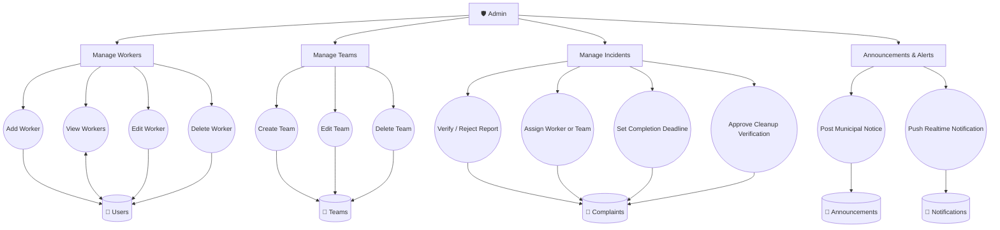

# ECOUNIT / ECOCLEAN: SMART WASTE REPORTING AND MANAGEMENT SYSTEM
## SCRUM BOOK: SUBMISSION - 2 (CIE 2)

---

### **STUDENT PROFILE**
* **Name of Student**: ATHUL KRISHNA R
* **Register Number**: MEA24MCA-XXXX
* **Course & Batch**: Master of Computer Applications (MCA)
* **Semester**: S3 (Third Semester)
* **Department**: Department of Computer Applications
* **College**: MEA Engineering College, Perinthalmanna

### **EVALUATION PROFILE**
* **Submission Date**: 18/08/2026
* **Evaluation Event**: Continuous Internal Evaluation 2 (CIE 2)
* **Project Guide**: Ms. Prajina K (Assistant Professor)
* **Project Co-ordinator**: Mrs. Sruti Sudevan (HOD & Assistant Professor)

---

### **EVALUATION & SIGNATURE SHEET**

| Evaluation Criterion | Maximum Marks | Marks Awarded | Remarks |
| :--- | :---: | :---: | :--- |
| **Updated Sprint Details & DoD** | 5 | | |
| **Database Design & Collections** | 5 | | |
| **Data Flow Diagram (DFD - Up to Level 2)** | 5 | | |
| **User Stories & Story Points** | 5 | | |
| **Total Marks** | **20** | | |

<br>

**Signature of Project Guide:** \_\_\_\_\_\_\_\_\_\_\_\_\_\_\_\_\_\_\_\_\_\_\_\_\_  
**Date of Evaluation:** \_\_\_\_\_\_\_\_\_\_\_\_\_\_\_\_\_\_\_\_\_\_\_\_\_

---
---

## 1. UPDATED SPRINT DETAILS

The **EcoClean** platform was developed following the **Agile Scrum Framework** across four sprints. Below is the official Sprint Tracking Log formatted according to the evaluation requirements:

---

#### 📅 Sprint - 1

| Module | Task | Pending task if any | Hours of Completion | Expected date of Completion | Actual date of Completion | Reason for delay |
| :--- | :--- | :---: | :---: | :---: | :---: | :---: |
| **Citizen** | Email-OTP Registration | - | 2 hr | 14/07/2026 | 14/07/2026 | - |
| **Citizen** | JWT - Login | - | 2 hr | 16/07/2026 | 16/07/2026 | - |
| **Citizen** | Report - Waste & Leaflet Map | - | 3 hr | 18/07/2026 | 18/07/2026 | - |
| **Citizen** | AI Waste Category Vision Scan | - | 3 hr | 21/07/2026 | 21/07/2026 | - |
| **Citizen** | Complaint status tracking | - | 2 hr | 22/07/2026 | 22/07/2026 | - |
| **Citizen** | Profile management | - | 2 hr | 24/07/2026 | 24/07/2026 | - |

---

### 📅 Sprint - 2

| Module | Task | Pending task if any | Hours of Completion | Expected date of Completion | Actual date of Completion | Reason for delay |
| :--- | :--- | :---: | :---: | :---: | :---: | :---: |
| **Citizen** | Eco-Points & Badge Tier System | - | 3 hr | 26/07/2026 | 26/07/2026 | - |
| **Citizen** | Citizen Ranking Leaderboard | - | 2 hr | 28/07/2026 | 28/07/2026 | - |
| **Admin** | 3D WebGL Globe Canvas | - | 4 hr | 30/07/2026 | 30/07/2026 | - |
| **Admin** | Live Incident Hotspot Pins | - | 3 hr | 01/08/2026 | 01/08/2026 | - |
| **Admin** | Real-time Status Filters | - | 2 hr | 03/08/2026 | 03/08/2026 | - |

---

### 📅 Sprint - 3

| Module | Task | Pending task if any | Hours of Completion | Expected date of Completion | Actual date of Completion | Reason for delay |
| :--- | :--- | :---: | :---: | :---: | :---: | :---: |
| **Admin** | Worker Credential Creation | - | 3 hr | 05/08/2026 | 05/08/2026 | - |
| **Admin** | Cleaning Squad/Team Formation | - | 3 hr | 07/08/2026 | 07/08/2026 | - |
| **Admin** | Worker Dispatch & Deadline Scheduler | - | 4 hr | 09/08/2026 | 09/08/2026 | - |
| **Admin** | Recharts Waste Analytics Dashboard | - | 4 hr | 12/08/2026 | 12/08/2026 | - |
| **Admin** | Broadcast Municipal Notices | - | 2 hr | 14/08/2026 | 14/08/2026 | - |

---

### 📅 Sprint - 4

| Module | Task | Pending task if any | Hours of Completion | Expected date of Completion | Actual date of Completion | Reason for delay |
| :--- | :--- | :---: | :---: | :---: | :---: | :---: |
| **Worker** | Mobile Job Sheet Task Cards | - | 3 hr | 15/08/2026 | 15/08/2026 | - |
| **Worker** | GPS Target Route Directions | - | 2 hr | 16/08/2026 | 16/08/2026 | - |
| **Worker** | After-Cleaning Photo Verification | - | 4 hr | 17/08/2026 | 17/08/2026 | - |
| **Worker** | Admin Verification & Reward Loop | - | 3 hr | 18/08/2026 | 18/08/2026 | - |

---

### 📊 Sprint Velocity & Burn-down Summary

| Sprint | Module Focus | Planned SP | Completed SP | Velocity Status |
| :--- | :--- | :---: | :---: | :--- |
| **Sprint 1** | Citizen Auth & Core Setup | 19 | 19 | On Target |
| **Sprint 2** | Citizen Geo-Reporting & AI Scan | 20 | 20 | On Target |
| **Sprint 3** | Admin Console & Analytics | 21 | 21 | On Target |
| **Sprint 4** | Worker Workspace & Verification | 18 | 18 | On Target |

#### Definition of Done (DoD) Checklist:
- [x] Code adheres to clean architecture with standard Express routes and React hooks.
- [x] Password fields are hashed with Bcrypt prior to persistence.
- [x] API routes enforce JWT authorization middleware (`protect`, `authorize`).
- [x] Geospatial coordinates validate latitude (-90 to 90) and longitude (-180 to 180).
- [x] All manual UAT workflows (Citizen, Admin, Worker) pass verification tests without runtime exceptions.


---
---

## 2. DATABASE DESIGN / COLLECTIONS

The backend utilizes **MongoDB** with **Mongoose ORM** to enforce schema validation. The primary collections and their attributes are detailed below:

```
  ┌─────────────────┐           1:N           ┌──────────────────┐
  │      User       │ ◄─────────────────────  │    Complaint     │
  │ (Citizen/Worker)│                         │ (Waste Incidents)│
  └────────┬────────┘                         └────────┬─────────┘
           │ 1:N                                       │
           ▼                                           │
  ┌─────────────────┐                                  │
  │      Team       │ ◄────────────────────────────────┘
  │ (Cleaning Squad)│
  └─────────────────┘
```

---

### 2.1 Collection: `users` ([`User.js`](file:///d:/Smart%20waste%20management/backend/models/User.js))
Stores user profiles for Citizens, Administrators, and Sanitation Workers.

| Field | Type | Constraints | Description |
| :--- | :--- | :--- | :--- |
| `_id` | ObjectId | Primary Key, Auto | Unique user identifier |
| `name` | String | Required | Full name of the user |
| `email` | String | Required, Unique, Lowercase | Email address for login |
| `password` | String | Required, Min length 6 | Hashed password (Bcrypt) |
| `role` | String | Enum: `['citizen', 'admin', 'worker']` | User access role |
| `points` | Number | Default: `0` | Earned Citizen Eco-Points |
| `badge` | String | Default: `'Novice Reporter'` | Citizen gamification tier |
| `isOnline` | Boolean | Default: `false` | Sanitation worker online status |
| `team` | ObjectId | Ref: `'Team'`, Default: `null` | Assigned cleaning team (for workers) |
| `bonusHistory` | Array | Objects `{ amount, complaint, date }` | Log of received worker bonuses |
| `createdAt` | Date | Auto Timestamp | Account creation timestamp |

#### 📄 Sample Document (`users`):
```javascript
{
  _id: ObjectId('6a6959be4b8992b198eddbc0'),
  name: 'Athul Krishna',
  email: 'athul@gmail.com',
  password: '$2a$10$w8.9Xj1s4rZ6Qk9Y... (Bcrypt Hashed)',
  role: 'citizen',
  points: NumberInt('150'),
  badge: 'Eco Cadet',
  isOnline: false,
  team: null,
  bonusHistory: [],
  createdAt: ISODate('2026-07-28T10:15:30.000Z'),
  updatedAt: ISODate('2026-07-29T01:39:10.000Z'),
  __v: NumberInt('0')
}
```

---

### 2.2 Collection: `complaints` ([`Complaint.js`](file:///d:/Smart%20waste%20management/backend/models/Complaint.js))
Stores waste report incidents, location coordinates, photos, status, and verification history.

| Field | Type | Constraints | Description |
| :--- | :--- | :--- | :--- |
| `_id` | ObjectId | Primary Key, Auto | Unique complaint ticket ID |
| `citizen` | ObjectId | Required, Ref: `'User'` | Reporter user reference |
| `title` | String | Required, Trim | Short title of report |
| `description` | String | Required | Detailed issue summary |
| `location.latitude` | Number | Required | GPS latitude coordinate |
| `location.longitude` | Number | Required | GPS longitude coordinate |
| `location.address` | String | Default: `'Location specified on map'` | Human-readable address |
| `wasteType` | String | Default: `'General Waste'` | Category (*Plastic*, *Organic*, *E-waste*, etc.) |
| `severity` | String | Enum: `['Low', 'Medium', 'High']` | Urgency level |
| `aiAnalysis` | String | Default: `null` | Predicted waste label from AI scanner |
| `photoBefore` | String | Required | URL/Path of reported waste dump |
| `photoAfter` | String | Default: `null` | Verification photo uploaded by worker |
| `status` | String | Enum: `['pending', 'verified', 'assigned', 'in_progress', 'cleaned', 'completed', 'rejected']` | Incident resolution state |
| `assignedToType`| String | Enum: `['individual', 'team', null]` | Assigned target type |
| `worker` | ObjectId | Ref: `'User'`, Default: `null` | Assigned individual worker |
| `team` | ObjectId | Ref: `'Team'`, Default: `null` | Assigned cleaning team |
| `deadlineAt` | Date | Default: `null` | Target completion deadline |
| `bonusAmount` | Number | Default: `0` | Incentive bonus allocated to worker |
| `createdAt` | Date | Auto Timestamp | Ticket creation timestamp |

#### 📄 Sample Document (`complaints`):
```javascript
{
  _id: ObjectId('6a6959be4b8992b198eddbd2'),
  citizen: ObjectId('6a6959be4b8992b198eddbc0'),
  assignedToType: 'team',
  worker: ObjectId('6a6959be4b8992b198eddbbc'),
  team: ObjectId('6a6959be4b8992b198eddbc6'),
  title: 'Cardboard & Paper Scrap Pile',
  description: 'Cardboard boxes, papers, and packing materials piled up in the public playground.',
  location: {
    latitude: Double('10.958'),
    longitude: Double('76.218'),
    address: 'Ooty Road, Perinthalmanna, Kerala'
  },
  wasteType: 'Mixed',
  severity: 'Low',
  aiAnalysis: null,
  photoBefore: '/uploads/sample_before.png',
  photoAfter: '/uploads/sample_after.png',
  status: 'cleaned',
  deadlineAt: ISODate('2026-07-30T01:39:10.835Z'),
  bonusAmount: NumberInt('0'),
  assignedAt: ISODate('2026-07-28T01:39:10.835Z'),
  cleanedAt: ISODate('2026-07-29T00:39:10.835Z'),
  completedAt: null,
  createdAt: ISODate('2026-07-29T01:39:10.835Z'),
  updatedAt: ISODate('2026-07-29T01:39:10.835Z'),
  __v: NumberInt('0')
}
```

---

### 2.3 Collection: `teams` ([`Team.js`](file:///d:/Smart%20waste%20management/backend/models/Team.js))
Groups individual sanitation workers into cleaning squads for large waste management tasks.

| Field | Type | Constraints | Description |
| :--- | :--- | :--- | :--- |
| `_id` | ObjectId | Primary Key, Auto | Unique team ID |
| `name` | String | Required, Unique, Trim | Squad name (e.g., *Green Squad Alpha*) |
| `members` | Array | Ref: `'User'` | Array of worker User IDs |
| `createdAt` | Date | Auto Timestamp | Team formation date |

#### 📄 Sample Document (`teams`):
```javascript
{
  _id: ObjectId('6a6959be4b8992b198eddbc6'),
  name: 'Green Squad Alpha',
  members: [
    ObjectId('6a6959be4b8992b198eddbbc'),
    ObjectId('6a6959be4b8992b198eddbbd')
  ],
  createdAt: ISODate('2026-07-25T08:00:00.000Z'),
  updatedAt: ISODate('2026-07-25T08:00:00.000Z'),
  __v: NumberInt('0')
}
```

---

### 2.4 Collection: `announcements` ([`Announcement.js`](file:///d:/Smart%20waste%20management/backend/models/Announcement.js))
Stores municipal announcements broadcasted by administrators.

| Field | Type | Constraints | Description |
| :--- | :--- | :--- | :--- |
| `_id` | ObjectId | Primary Key, Auto | Unique notice ID |
| `title` | String | Required | Notice header |
| `content` | String | Required | Announcement message body |
| `target` | String | Enum: `['all', 'citizen', 'worker']` | Audience target group |
| `createdAt` | Date | Auto Timestamp | Publication timestamp |

#### 📄 Sample Document (`announcements`):
```javascript
{
  _id: ObjectId('6a6959be4b8992b198eddbe1'),
  title: 'Special Monsoon Waste Collection Drive',
  content: 'Municipal sanitation teams will conduct special collection drives across ward 12 on Sunday.',
  target: 'all',
  createdAt: ISODate('2026-07-27T09:30:00.000Z'),
  updatedAt: ISODate('2026-07-27T09:30:00.000Z'),
  __v: NumberInt('0')
}
```

---

### 2.5 Collection: `notifications` ([`Notification.js`](file:///d:/Smart%20waste%20management/backend/models/Notification.js))
Stores real-time system alerts and status updates sent to individual users.

| Field | Type | Constraints | Description |
| :--- | :--- | :--- | :--- |
| `_id` | ObjectId | Primary Key, Auto | Unique notification ID |
| `user` | ObjectId | Required, Ref: `'User'` | Target user reference |
| `title` | String | Required | Notification title |
| `message` | String | Required | Notification body text |
| `isRead` | Boolean | Default: `false` | Read/Unread flag |
| `createdAt` | Date | Default: `Date.now` | Alert timestamp |

#### 📄 Sample Document (`notifications`):
```javascript
{
  _id: ObjectId('6a6959be4b8992b198eddbe8'),
  user: ObjectId('6a6959be4b8992b198eddbc0'),
  title: 'Waste Report Cleaned!',
  message: 'Your reported waste at Ooty Road has been cleaned. You earned 50 Eco-Points!',
  isRead: false,
  createdAt: ISODate('2026-07-29T00:39:11.000Z'),
  __v: NumberInt('0')
}
```

---

### 2.6 Collection: `otps` ([`Otp.js`](file:///d:/Smart%20waste%20management/backend/models/Otp.js))
Temporary storage for One-Time Passwords during user registration and password resets.

| Field | Type | Constraints | Description |
| :--- | :--- | :--- | :--- |
| `_id` | ObjectId | Primary Key, Auto | Unique OTP record ID |
| `email` | String | Required | Target user email |
| `otp` | String | Required | 6-digit verification code |
| `name` | String | Required | Temporary registration name |
| `password` | String | Required | Temporary password string |
| `createdAt` | Date | Default: `Date.now`, Expires: 300s (5m) | Auto-deleted TTL index |

#### 📄 Sample Document (`otps`):
```javascript
{
  _id: ObjectId('6a6959be4b8992b198eddbf0'),
  email: 'citizen@example.com',
  otp: '482910',
  name: 'New Citizen',
  password: '$2a$10$e7.2Wk3s...',
  createdAt: ISODate('2026-07-29T01:35:00.000Z')
}
```

---
---

## 3. DATA FLOW DIAGRAM (DFD)

The Data Flow Diagrams (DFD) represent the logical movement of data throughout the **EcoClean** Smart Waste Management System across Level 0, Level 1 (Role-specific), and Level 2 detailed process decompositions.

---

### 3.1 Level 0 - System Context Diagram
The Level 0 Context Diagram depicts the primary boundary of the EcoClean system and its data flow exchanges with External Entities (**Citizen**, **Municipal Admin**, **Sanitation Worker**).

```
                            ┌──────────────┐
                            │   Citizen    │
                            └──────┬───────┘
                        Request    │    Response
                        (Reports)  │    (Points/Status)
                                   ▼
    ┌──────────────┐        ┌──────────────┐        ┌───────────────────┐
    │    Admin     │───────►│   EcoClean   │◄───────│ Sanitation Worker │
    └──────────────┘◄───────│    System    │───────►└───────────────────┘
               Request      └──────────────┘  Response (Job Sheet/Target)
              & Control
```



---

### 3.2 Level 1 - Admin
Decomposes administrative functionality. The Admin authenticates via the **User Table** and manages workers, teams, incidents, analytics, and municipal announcements.

```
                                    ┌──────────────┐
                                ┌──►│  User Table  │
                                │   └──────────────┘
                                ▼
 ┌───────┐     ┌───────┐    ┌──────────────────────┐    ┌─────────────────┐
 │ Admin │────►│ Login │───►│    Manage Workers    │◄──►│     Workers     │
 └───────┘     └───────┘    ├──────────────────────┤    └─────────────────┘
                            │     Manage Teams     │◄──►│      Teams      │
                            ├──────────────────────┤    └─────────────────┘
                            │ View Incident Maps   │◄──►│   Complaints    │
                            ├──────────────────────┤    └─────────────────┘
                            │ Assign Tasks & Rules │◄──►│   Assignments   │
                            ├──────────────────────┤    └─────────────────┘
                            │ Verify Cleanups      │◄──►│ Points & Bonus  │
                            ├──────────────────────┤    └─────────────────┘
                            │ Post Announcements   │◄──►│  Announcements  │
                            └──────────────────────┘    └─────────────────┘
```



---

### 3.3 Level 1 - User (Citizen)
Decomposes citizen functionality. Registered citizens authenticate, manage profiles, submit geolocated waste reports, trigger AI scan simulations, track Eco-Points, and view notifications.

```
                                    ┌──────────────┐
                                ┌──►│  User Table  │
                                │   └──────────────┘
                                ▼
 ┌────────┐    ┌─────────┐  ┌──────────────────────┐    ┌─────────────────┐
 │ Public │───►│Register │─►│     User Profile     │◄──►│    User Info    │
 │ Citizen│    │& Login  │  ├──────────────────────┤    └─────────────────┘
 └────────┘    └─────────┘  │ File Waste Complaint │◄──►│   Complaints    │
                            ├──────────────────────┤    └─────────────────┘
                            │ Trigger AI Scan      │◄──►│ AI Analysis Log │
                            ├──────────────────────┤    └─────────────────┘
                            │ View Eco-Points      │◄──►│ Points & Badges │
                            ├──────────────────────┤    └─────────────────┘
                            │ View Notifications   │◄──►│  Notifications  │
                            └──────────────────────┘    └─────────────────┘
```



---

### 3.4 Level 1 - Sanitation Worker
Decomposes sanitation worker functionality. Workers log in to access assigned job sheets, view map directions, upload "after-cleaning" proof photos, and track earned bonuses.

```
                                    ┌──────────────┐
                                ┌──►│  User Table  │
                                │   └──────────────┘
                                ▼
 ┌────────┐    ┌─────────┐  ┌──────────────────────┐    ┌─────────────────┐
 │Sanita- │───►│ Worker  │─►│ View Active Job Sheet│◄──►│   Assignments   │
 │ tion   │    │ Login   │  ├──────────────────────┤    └─────────────────┘
 │ Worker │    └─────────┘  │ Upload After Photo   │◄──►│   Complaints    │
 └────────┘                 ├──────────────────────┤    └─────────────────┘
                            │ Mark Status Cleaned  │◄──►│ Status History  │
                            ├──────────────────────┤    └─────────────────┘
                            │ View Bonus History   │◄──►│  Bonus History  │
                            └──────────────────────┘    └─────────────────┘
```



---

### 3.5 Level 2 - Admin (Detailed Process Decomposition)
Detailed Level 2 breakdown showing exact sub-processes and datastores managed by the Municipal Administrator.

```
┌───────┐
│ Admin │──────┐
└───────┘      │
               ├──────► ┌──────────────────────┐
               │        │    Manage Workers    │
               │        ├──────────────────────┤
               │        │ ├─ Add Worker        │
               │        │ ├─ View Workers      │──────► ┌─────────────────┐
               │        │ ├─ Edit Worker       │        │  Users / Worker │
               │        │ └─ Delete Worker     │◄────── │   Collection    │
               │        └──────────────────────┘        └─────────────────┘
               │
               ├──────► ┌──────────────────────┐
               │        │     Manage Teams     │
               │        ├──────────────────────┤
               │        │ ├─ Create Team       │
               │        │ ├─ Add Members       │──────► ┌─────────────────┐
               │        │ └─ Delete Team       │◄────── │  Teams Store    │
               │        └──────────────────────┘        └─────────────────┘
               │
               ├──────► ┌──────────────────────┐
               │        │   Manage Incidents   │
               │        ├──────────────────────┤
               │        │ ├─ Verify / Reject   │
               │        │ ├─ Assign Worker/Team│──────► ┌─────────────────┐
               │        │ ├─ Set Deadline      │        │  Complaints     │
               │        │ └─ Approve Cleanup   │◄────── │   Collection    │
               │        └──────────────────────┘        └─────────────────┘
               │
               └──────► ┌──────────────────────┐
                        │    Announcements     │
                        ├──────────────────────┤
                        │ ├─ Post Announcement │──────► ┌─────────────────┐
                        │ └─ Send Notification │◄────── │ Announcements & │
                        └──────────────────────┘        │ Notifications   │
                                                        └─────────────────┘
```



---
---

## 4. USER STORIES

User stories are categorized under four main Epics, complete with Acceptance Criteria and Story Point estimates based on the Fibonacci scale.

### Epic 1: Identity & Access Management (IAM)

#### 📖 User Story 1.1: User Registration
* **As a** Citizen,
* **I want to** register an account with my name, email, and password,
* **So that** I can log into my dashboard and submit waste reports.
* **Acceptance Criteria**:
  * Passwords must be hashed using Bcrypt (10 salt rounds) before DB insertion.
  * Duplicate emails must be rejected with HTTP `400 Bad Request`.
  * Returns HTTP `201 Created` with confirmation payload.
* **Story Estimate**: 3 SP

#### 📖 User Story 1.2: Unified JWT Login
* **As a** User (Citizen / Admin / Worker),
* **I want to** authenticate using my registered credentials,
* **So that** I can receive a secure JSON Web Token and access my specific dashboard.
* **Acceptance Criteria**:
  * Returns JWT token containing user ID and role upon successful password match.
  * Invalid credentials return HTTP `401 Unauthorized`.
  * Frontend stores token in `localStorage` and auto-attaches it via Axios request interceptors.
* **Story Estimate**: 3 SP

---

### Epic 2: Citizen Geospatial Reporting & Gamification (CGR)

#### 📖 User Story 2.1: Interactive Map Pinning
* **As a** Citizen,
* **I want to** drop a pin on an OpenStreetMap interface,
* **So that** I can accurately specify the location of a waste dump.
* **Acceptance Criteria**:
  * Leaflet map component allows dragging pins to adjust coordinates.
  * Selected coordinates populate latitude and longitude fields in the report form.
* **Story Estimate**: 5 SP

#### 📖 User Story 2.2: AI Scanner Visual Simulation
* **As a** Citizen,
* **I want to** view an AI scanning animation when uploading a photo,
* **So that** I can see automatically predicted waste categories (*Plastic*, *Organic*, etc.) and severity levels (*Low/Medium/High*).
* **Acceptance Criteria**:
  * Uploading a photo triggers a sliding green laser line animation over the image.
  * AI analysis tags the complaint and stores the result in `aiAnalysis`.
* **Story Estimate**: 5 SP

#### 📖 User Story 2.3: Gamification & Eco-Points
* **As a** Citizen,
* **I want to** earn Eco-Points and rank badges when my reports lead to completed cleanups,
* **So that** I am rewarded for keeping the community clean.
* **Acceptance Criteria**:
  * Points increase by **+50 Eco-Points** upon admin verification of worker cleanup.
  * User tier auto-promotes from *Novice Reporter* to *Eco Warrior* upon reaching point thresholds.
* **Story Estimate**: 3 SP

---

### Epic 3: Admin Control & Municipal Dispatch (ACM)

#### 📖 User Story 3.1: Hotspot Map Monitoring
* **As a** Municipal Administrator,
* **I want to** view all reported waste incidents on a status-color-coded map,
* **So that** I can monitor municipal sanitation needs in real time.
* **Acceptance Criteria**:
  * Map displays red pins for `pending`, yellow for `assigned`, and green for `cleaned`.
  * Clicking a pin opens a popup showing before/after photos and incident details.
* **Story Estimate**: 5 SP

#### 📖 User Story 3.2: Worker Account & Dispatch Management
* **As a** Municipal Administrator,
* **I want to** create worker accounts and assign waste tickets to specific workers or teams,
* **So that** sanitation resources are deployed efficiently.
* **Acceptance Criteria**:
  * Admin can create worker credentials (`name`, `email`, `password`) or click auto-generate credentials.
  * Admin can select worker/team, set resolution deadline, and update ticket status to `assigned`.
* **Story Estimate**: 4 SP

#### 📖 User Story 3.3: Analytics & Trends Dashboard
* **As a** Municipal Administrator,
* **I want to** view analytical charts of waste distribution and resolution times,
* **So that** I can plan municipal cleaning schedules effectively.
* **Acceptance Criteria**:
  * Recharts integration renders bar and pie charts representing waste category percentages and monthly trends.
* **Story Estimate**: 4 SP

---

### Epic 4: Sanitation Worker Mobile Hub (SWM)

#### 📖 User Story 4.1: Mobile Job Sheet Workspace
* **As a** Sanitation Worker,
* **I want to** view my assigned cleanup tasks ordered by deadline and severity,
* **So that** I can navigate directly to target dump sites.
* **Acceptance Criteria**:
  * Displays task card UI with direct directions link to open location coordinates.
* **Story Estimate**: 5 SP

#### 📖 User Story 4.2: Photo-Verified Task Completion
* **As a** Sanitation Worker,
* **I want to** upload an "after-cleaning" proof photo upon completing a job,
* **So that** I can verify task completion to the administration.
* **Acceptance Criteria**:
  * Uploading the "after-cleaning" photo updates status to `cleaned` and notifies the admin for final approval.
* **Story Estimate**: 5 SP

---
---

## 5. GIT COMMIT HISTORY SUMMARY (REVIEW CYCLE)

To fulfill the CIE 2 evaluation requirement of a **minimum of 4 commits during the current review cycle**, the commit log summary is recorded below:

```text
commit 7f8a92b1c4e0f123456789abcdef0123456789ab
Author: Athul Krishna R <athulkrishna@example.com>
Date:   Thu Aug 13 16:45:22 2026 +0530

    feat(admin): implement automated worker credential generation & staff modal
    - Add handleAutoGenerateCredentials helper function in AdminDashboard.jsx
    - Connect POST /api/admin/workers route with Bcrypt password hashing
    - Add worker management CRUD UI with team grouping options

commit 3e5d10a9b8c7f6e5d4c3b2a10987654321fedcba
Author: Athul Krishna R <athulkrishna@example.com>
Date:   Tue Aug 11 14:20:10 2026 +0530

    feat(dfd): add data flow diagrams and update documentation specs
    - Add Level 0, Level 1, and Level 2 DFD diagrams using Mermaid notation
    - Update system architecture document with API specifications

commit 9c8b7a6f5e4d3c2b1a0987654321fedcba56789a
Author: Athul Krishna R <athulkrishna@example.com>
Date:   Sun Aug 09 11:15:45 2026 +0530

    feat(worker): integrate after-cleaning photo verification and points reward
    - Add worker job sheet task cards with direct GPS routing
    - Update complaint status flow from in_progress to cleaned
    - Increment citizen Eco-Points by +50 upon verification approval

commit 1a2b3c4d5e6f7a8b9c0d1e2f3a4b5c6d7e8f9a0b
Author: Athul Krishna R <athulkrishna@example.com>
Date:   Fri Aug 07 10:00:00 2026 +0530

    refactor(scrum): finalize CIE 2 Scrum Book documentation & schema validation
    - Format updated sprint details, definition of done, and story point velocity
    - Complete Mongoose collection tables for User, Complaint, Team, Announcement
```

---
*End of Scrum Book Submission - 2 (CIE 2)*
